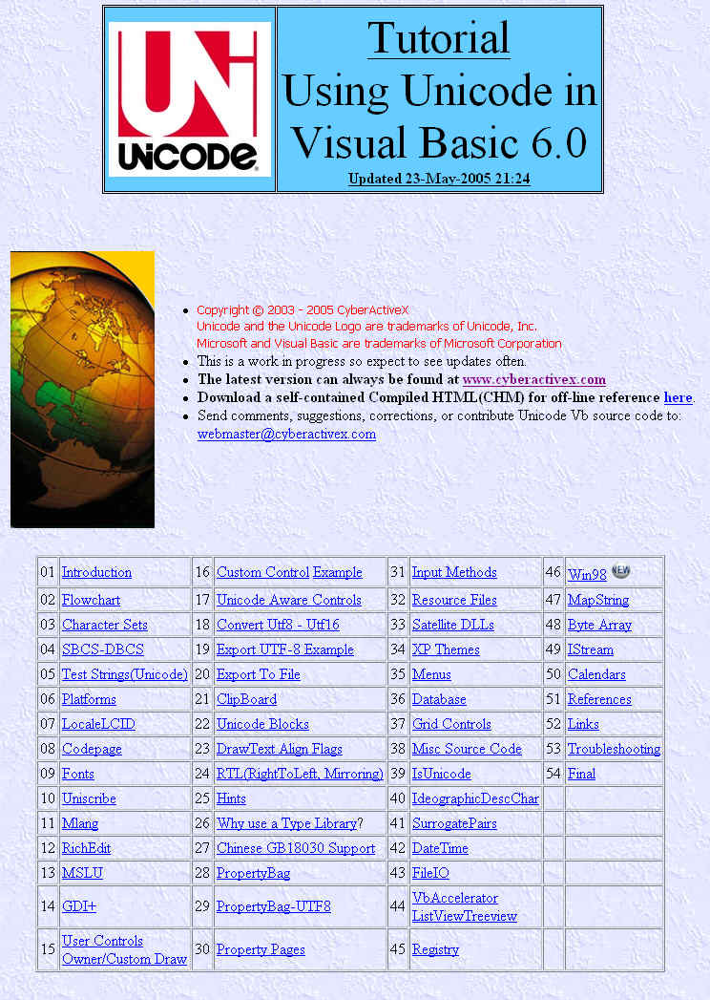



## Unicode Tutorial Vb

### Description

Tutorial how to use Unicode in Visual Basic.

52 Sections. Appx 1Mb download. See Screenshot for Index of Sections.
 
### More Info
 

             |
---                |---
**Submitted On**   |2005-05-23 20:57:02
**By**             |[Dana Seaman\_](https://github.com/Planet-Source-Code/PSCIndex/blob/master/ByAuthor/dana-seaman.md)
**Level**          |Advanced
**User Rating**    |5.0 (40 globes from 8 users)
**Compatibility**  |VB 5\.0, VB 6\.0
**Category**       |[Custom Controls/ Forms/  Menus](https://github.com/Planet-Source-Code/PSCIndex/blob/master/ByCategory/custom-controls-forms-menus__1-4.md)
**World**          |[Visual Basic](https://github.com/Planet-Source-Code/PSCIndex/blob/master/ByWorld/visual-basic.md)
**Archive File**   |[Unicode\_Tu1891395232005\.zip](https://github.com/Planet-Source-Code/dana-seaman-unicode-tutorial-vb__1-60608/archive/master.zip)

